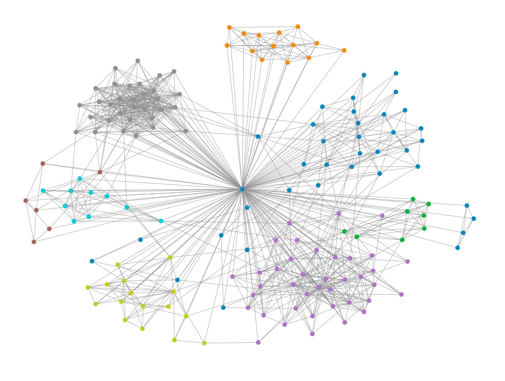

# facebook-friend-network

A little project that graphs and analyzes your facebook friend network. It built off of [Yihui Fan](https://www.databentobox.com/2019/07/28/facebook-friend-graph/)'s article which, in turn, built off of [Eliot Andre](https://github.com/EliotAndres/facebook-friend-graph)'s code, which, finally, was built off of [Lucas Allen](https://github.com/lgallen/twitter-graph)'s original code.
After building the friend graph, it uses the Louvain Community Detection algorithm to group friends into perceived categories. For some more info regarding how this algorithm works, check out [this article](https://medium.com/walmartglobaltech/demystifying-louvains-algorithm-and-its-implementation-in-gpu-9a07cdd3b010) .

**What I changed and added:**
- Updated HTML parsing to work with the Classic Facebook UI
- Parsing now extracts not only username but friends' names as well
- Added graph labeling options by full name, first name, and initials
- Organized code for easier reading
- Plus other minor changes/fixes/additions

**Before running this code:**
- Scan through the aforementioned article
- Install the libraries: `pip install -r requirements.txt`
- Install [Selenium ChromeDriver](https://www.kenst.com/2015/03/installing-chromedriver-on-mac-osx/)
- Scraping your friends list will take some time: 25 secs/friend for me, 80 mins for 189 friends. You could go faster by removing the sleep intervals, but if you go too fast your account could temporarily get blocked.
- If scraping gets interrupted, you don't have to start from scratch since previously detected friends are saved in file.
- plotNetwork.py graphs the Louvain-grouped communities
- networkAnalysis.py uses code from Yihui's article to examine/graph degree, closeness, and betweenness centrality
- networkStats is a work in progress - hope to eventually add more metrics for Social Network Analysis

**My Results:**

When building the graph, I dropped friends with less than 3 mutual friends in order to get more clear and accurate cliques. As a result, I got a very interconnected network with only two small isolated cliques – a consequence of being a university student and a Bay Area native, I suppose.

I found Louvain's algorithm to be fairly successful at its grouping task, although it did mislabel a couple of my friends, generally those serving as a bridge between friend groups.